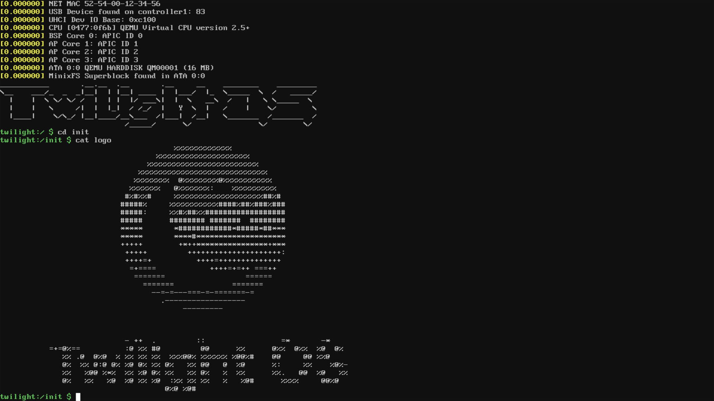
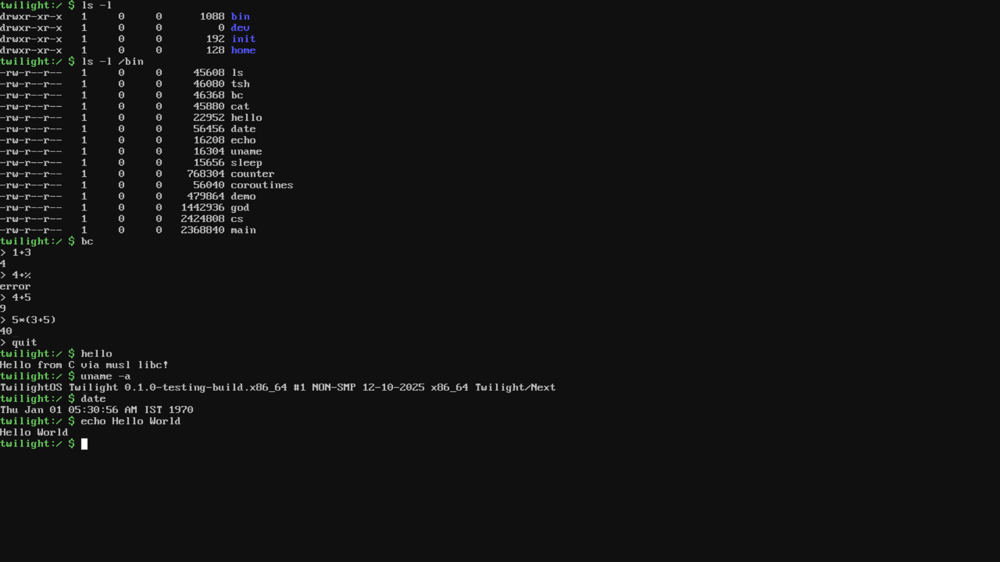

# Rimmy OS

## Overview

Rimmy OS is a lightweight operating system designed for general-purpose computing, embedded systems & learning purpose. It is written in Rust programming language.
It currently supports x86_64 architecture. future plans include support for ARM/RISC-V architecture.

## Rimmy OS running basic Unix shell utilities

<table>
  <tr>
    <td></td>
    <td></td>
  </tr>
</table>

## Features

- Lightweight and efficient
- Terminal support (kernel built-in)
- RTC
- ACPI - power off
- VFS, Rimmy FS
- basic unix commands (kernel built-in)
- asynchronous I/O
- memory management
- frame buffer (/dev/fb0)
- ATA
- basic shell with shell history
- SMP detection (no multi-threading yet)

## Goal 0.1.0 Release

- [x] VFS & RamFS
- [x] Better user friendly Terminal
- [x] asynchronous I/O
- [x] memory management
- [x] PCI device detection
- [x] TFS Filesystem (in heavy development)
- [x] Network Stack
- [x] Userspace utilities (work remains on frame deallocation and process)
- [x] Basic shell
- [x] RTC
- [x] ATA
- [ ] Kernel Level NES Emulator
- [ ] DOOM (because why not?)

## Build Instructions

### ✅ Requirements

Rimmy OS builds require:

- **Rust** (nightly, with `x86_64-unknown-none` target)
- `llvm-tools-preview` component
- `cargo build` with build-std
- `nasm` (for assembly boot code)
- `ld` (GNU binutils linker)
- `xorriso` (for ISO creation)
- `qemu` (for virtualization)
- `musl-gcc`

---

### ✅ Installing dependencies

#### **Linux**

- _Debian / Ubuntu_

```bash
sudo apt update
sudo apt install build-essential nasm qemu-system-x86 xorriso gcc musl-tools
rustup target add x86_64-unknown-none
rustup component add llvm-tools-preview
```

- _Fedora_

```bash
sudo dnf install make nasm qemu-system-x86 xorriso musl-gcc
rustup target add x86_64-unknown-none
rustup component add llvm-tools-preview
```

- _Arch Linux_

```bash
sudo pacman -S base-devel nasm qemu xorriso musl
rustup target add x86_64-unknown-none
rustup component add llvm-tools-preview
```

---

#### **macOS**

You can use **Homebrew**:

```bash
brew install nasm qemu xorriso
rustup target add x86_64-unknown-none
rustup component add llvm-tools-preview
```

---

#### **Windows**

We recommend using **WSL2** with Ubuntu/Fedora:

1. Install WSL2 following Microsoft’s guide
2. Inside WSL, follow the same instructions as Linux above

---

## ✅ Building & Run

In the workspace directory, run:

```bash
make run
```

---

---

## ✅ First Boot

On first boot, you **must** initialize the filesystem:

```bash
install
```

inside the VM shell to format your disk.

## Documentation

Rimmy OS documentation is available at [https://rimmy-os.vercel.app](https://rimmy-os.vercel.app).

## License

Rimmy OS is licensed under the BSD-3 Clause License. See the [LICENSE](LICENSE) file for details.

## Contributing

Contributions to Rimmy OS are welcome!
